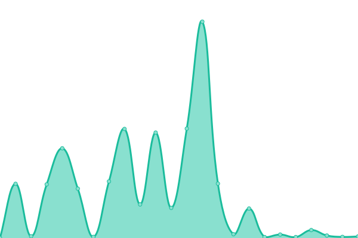
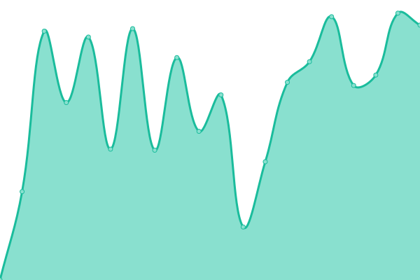
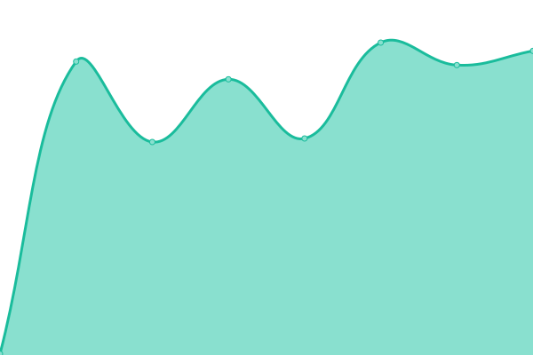
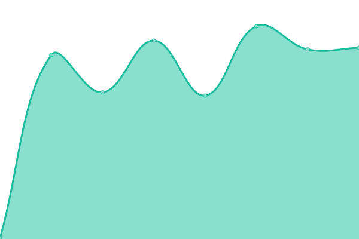
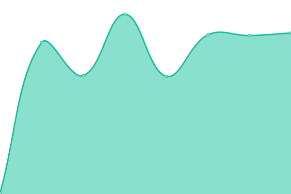
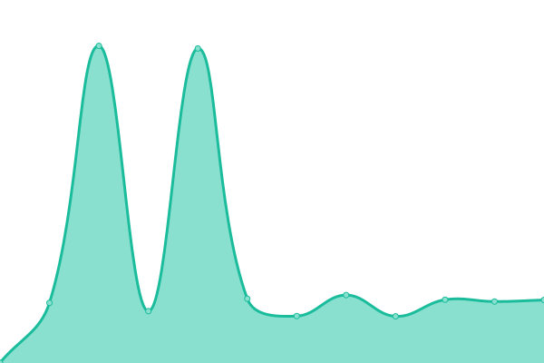
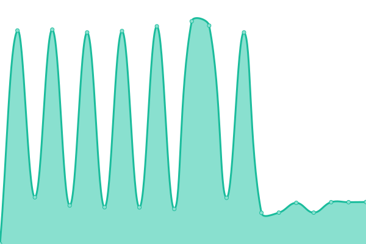

# [📈 Live Status](https:///upptime): <!--live status--> **🟧 Partial outage**

This repository contains the open-source uptime monitor and status page for [oxstreet](www.oxstreet.com), powered by [Upptime](https://github.com/upptime/upptime).

With [Upptime](https://upptime.js.org), you can get your own unlimited and free uptime monitor and status page, powered entirely by a GitHub repository. We use [Issues](https://github.com/oxstreet/upptime/issues) as incident reports, [Actions](https://github.com/oxstreet/upptime/actions) as uptime monitors, and [Pages](https:///upptime) for the status page.

<!--start: status pages-->
<!-- This summary is generated by Upptime (https://github.com/upptime/upptime) -->
<!-- Do not edit this manually, your changes will be overwritten -->
<!-- prettier-ignore -->
| URL | Status | History | Response Time | Uptime |
| --- | ------ | ------- | ------------- | ------ |
|  [Ox Street](https://oxstreet.com) | 🟥 Down | [ox-street.yml](https://github.com/oxstreet/oxstreet-status-page/commits/HEAD/history/ox-street.yml) | 

 739ms
     
 | 

<a href="https://oxstreet.github.io/oxstreet-status-page/history/ox-street">98.60%</a>
    

|  [Homepage API](https://api.oxstreet.com/layouts/v1/public/homepage) | 🟥 Down | [homepage-api.yml](https://github.com/oxstreet/oxstreet-status-page/commits/HEAD/history/homepage-api.yml) | 

 2065ms
     
 | 

<a href="https://oxstreet.github.io/oxstreet-status-page/history/homepage-api">98.46%</a>
    

|  [Product service](https://api.oxstreet.com/products/v1/healthcheck) | 🟩 Up | [product-service.yml](https://github.com/oxstreet/oxstreet-status-page/commits/HEAD/history/product-service.yml) | 

 228ms
     
 | 

<a href="https://oxstreet.github.io/oxstreet-status-page/history/product-service">100.00%</a>
    

|  [User service](https://api.oxstreet.com/users/v1/healthcheck) | 🟩 Up | [user-service.yml](https://github.com/oxstreet/oxstreet-status-page/commits/HEAD/history/user-service.yml) | 

 227ms
     
 | 

<a href="https://oxstreet.github.io/oxstreet-status-page/history/user-service">100.00%</a>
    

|  [Order service](https://api.oxstreet.com/orders/v1/healthcheck) | 🟩 Up | [order-service.yml](https://github.com/oxstreet/oxstreet-status-page/commits/HEAD/history/order-service.yml) | 

 228ms
     
 | 

<a href="https://oxstreet.github.io/oxstreet-status-page/history/order-service">100.00%</a>
    

|  [Payment service](https://api.oxstreet.com/payments/v1/healthcheck) | 🟩 Up | [payment-service.yml](https://github.com/oxstreet/oxstreet-status-page/commits/HEAD/history/payment-service.yml) | 

 334ms
     
 | 

<a href="https://oxstreet.github.io/oxstreet-status-page/history/payment-service">100.00%</a>
    

|  [Layout service](https://api.oxstreet.com/layouts/v1/healthcheck) | 🟥 Down | [layout-service.yml](https://github.com/oxstreet/oxstreet-status-page/commits/HEAD/history/layout-service.yml) | 

 631ms
     
 | 

<a href="https://oxstreet.github.io/oxstreet-status-page/history/layout-service">98.72%</a>
    

<!--end: status pages-->

[**Visit our status website →**](https:///upptime)

## 📄 License

- Powered by: [Upptime](https://github.com/upptime/upptime)
- Code: [MIT](./LICENSE) © [oxstreet](www.oxstreet.com)
- Data in the `./history` directory: [Open Database License](https://opendatacommons.org/licenses/odbl/1-0/)
